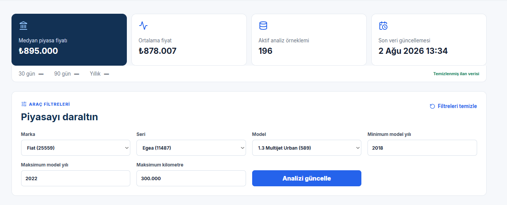
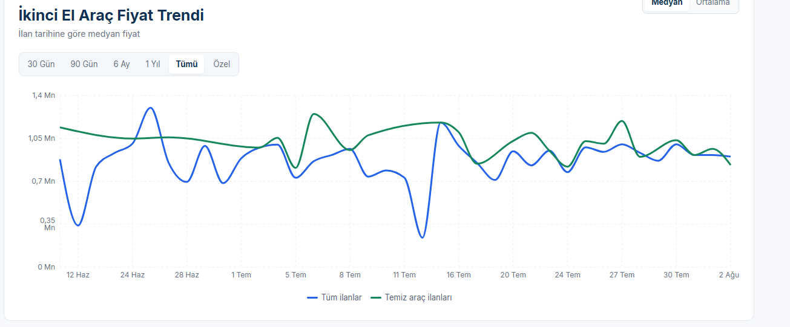
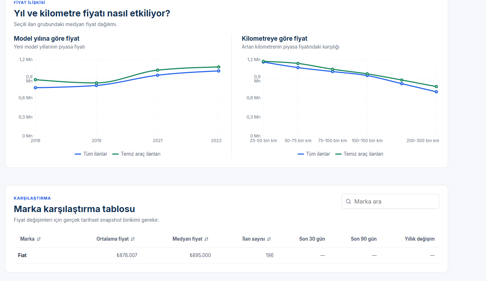

# Sprint 2 Kanıtları

Bu proje bireysel yürütüldüğü için geriye dönük toplantı kaydı veya temsilî board oluşturulmamıştır.

- [Teknik çalışma günlüğü](work-log.md), veri temizleme, piyasa analizi ve arayüz yönüyle ilgili gerçek commitleri listeler.
- [Piyasa trendleri ekranı](market-trends.png), çalışan web uygulamasının gerçek yerel ekran görüntüsüdür.
- [Sprint review ve retrospective](../README.md), Streamlit prototipinden React arayüzüne geçiş kararını açıklar.

Ekran görüntüsü, 30 Temmuz 2026 tarihinde Docker ile çalıştırılan uygulamadan alınmıştır.

## Ek Ürün Kanıtları

Aşağıdaki ekranlar, aynı çalışan Docker uygulamasından alınan Fiat Egea
örneğinde piyasa analizi akışını gösterir.

### Filtreli piyasa analizi

Marka, seri, model, yıl ve kilometre filtreleri uygulanarak analiz örneklemi
daraltılır. Üst alandaki metrikler seçilen veri grubunun medyan ve ortalama
fiyatını, aktif örneklem sayısını ve son veri güncellemesini gösterir.

### İlan tarihine göre fiyat trendi

Grafik ilan yayım tarihine göre medyan fiyatı verir. Mavi çizgi tüm ilanları,
yeşil çizgi ise temiz beyanlı ilanları temsil eder; bu sayede iki grubun piyasa
görünümü aynı tarih ekseninde karşılaştırılabilir.

### Model yılı ve kilometre ilişkisi

Seçili ilan grubunda model yılına ve kilometre bandına göre medyan fiyatlar
ayrı grafiklerde gösterilir. Bu ekran, fiyat analizinin tek bir ortalama yerine
araç özellikleriyle birlikte yorumlandığını kanıtlar.

