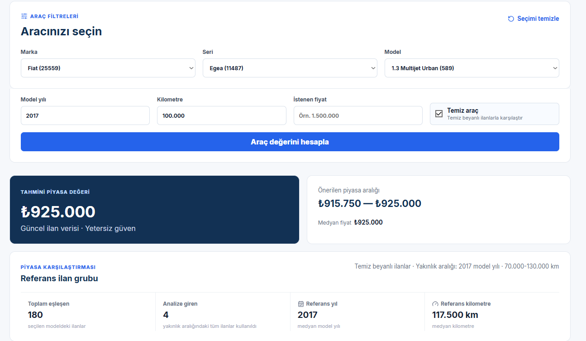
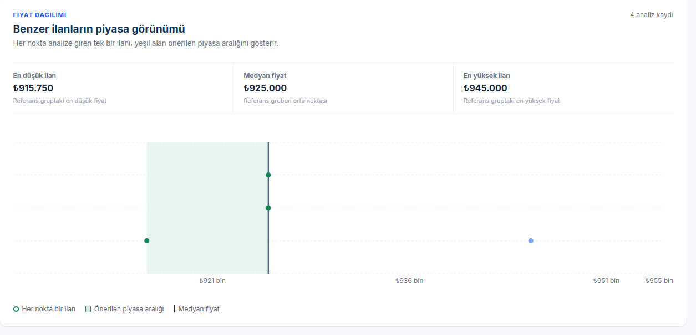
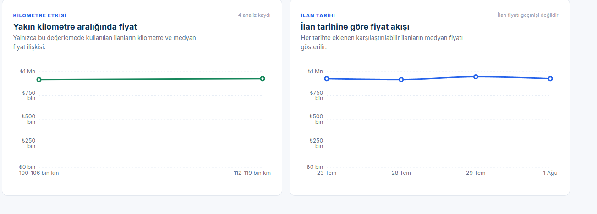

# Sprint 3 Kanıtları

Bu proje bireysel yürütüldüğü için geriye dönük toplantı kaydı veya temsilî board oluşturulmamıştır.

- [Değerleme sonucu](valuation-result.png), gerçek API sonucu ile üretilmiş araç değerleme ekranıdır.
- [Teknik doğrulama](verification.md), test, production build ve Docker çalışma sonucunu kaydeder.
- [Sprint review ve retrospective](../README.md), güncel piyasa fiyatı ile kondisyon modeli kararını açıklar.
- [Model kartı](../../../docs/model-card.md) ve [mimari dokümanı](../../../docs/architecture.md), model ve sistem tasarımının ayrıntılarını içerir.

Ekran görüntüsü, 30 Temmuz 2026 tarihinde Docker ile çalıştırılan uygulamadan alınmıştır.

## Ek Ürün Kanıtları

Aşağıdaki ekranlar, Fiat Egea 1.3 Multijet Urban örneğiyle değerleme akışının
güncel ilan verisi, temiz araç seçeneği ve şeffaf grafiklerle nasıl çalıştığını
gösterir.

### Temiz araç değerlemesi

Kullanıcı model yılı ve kilometre bilgisini girdikten sonra temiz araç seçeneği
ile yalnızca temiz beyanlı ilanları kullanabilir. Sonuç kartları tahmini piyasa
değerini, önerilen aralığı, referans yılını ve kilometreyi açıklar. Örneklem
küçük olduğunda uygulama bunu "Yetersiz güven" etiketiyle açıkça belirtir.

### Benzer ilanların fiyat dağılımı

Her nokta analize giren tek bir ilanı temsil eder. Yeşil alan önerilen piyasa
aralığını, koyu dikey çizgi medyan fiyatı gösterir. Bu sayede kullanıcı, tahminin
dayandığı fiyat yoğunluğunu görebilir.

### Değerleme grubunun bağlam grafikleri

Solda yalnızca değerlemede kullanılan ilanların kilometre-fiyat ilişkisi, sağda
ise aynı grubun ilan tarihine göre medyan fiyatı verilir. Grafik başlıkları ve
örneklem sayısı, sınırlı veri durumunda sonucun nasıl yorumlanması gerektiğini
şeffaf biçimde ifade eder.

