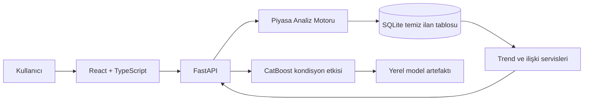

# Mimari

## Katmanlar

| Katman | Konum | Sorumluluk |
| --- | --- | --- |
| Web arayüzü | `web/` | Kullanıcıdan araç bilgilerini almak ve piyasa sonucunu görselleştirmek |
| API | `src/api/` | Tip güvenli endpointler, veri erişimi ve servis koordinasyonu |
| Piyasa motoru | `src/analysis/market_engine.py` | Benzerlik puanlama, uç fiyat temizleme ve fiyat aralığı |
| Veri erişimi | `src/api/database.py` | SQLite temiz/ham tablo seçimi ve filtreli sorgular |
| Veri temizleme | `src/maintenance/clean_vehicle_data.py` | Normalizasyon, tekrar temizliği ve analiz tablosu üretimi |
| ML | `src/ml/` | Boya/değişen etkisi için eğitim ve çıkarım |

## Değerleme Akışı

1. Kullanıcı araç bilgisini girer.
2. API, temiz ilan tablosundan aynı marka, seri ve modele ait kayıtları getirir.
3. Piyasa motoru yıl, kilometre, model yakınlığı ve veri güncelliğine göre ilanları puanlar.
4. Aykırı fiyatlar çıkarılır; ağırlıklı medyan ile alt/üst piyasa aralığı hesaplanır.
5. Boya ve değişen bilgisi varsa ML modeli yalnızca kondisyon katsayısını üretir.
6. Katsayı güncel piyasa değerine uygulanır ve sonuç React arayüzünde gösterilir.

## Yerel Çalışma Sınırı

SQLite verisi ve model artefaktı repoya dahil edilmez. Bunlar kişisel veri içermeyen yerel çalışma çıktıları olarak tutulur. Uygulama veri bulunmadığında açık bir durum mesajı verir; sahte piyasa verisi üretmez.
